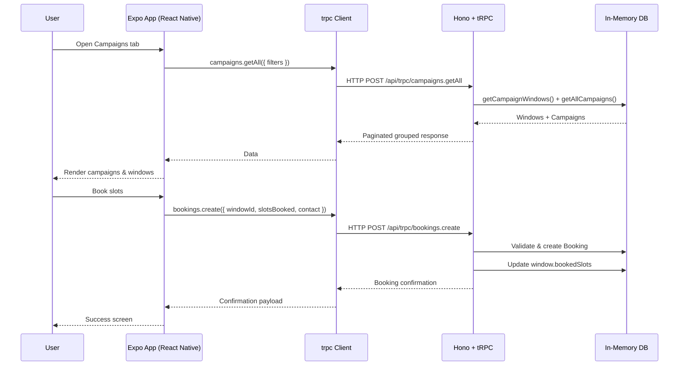

# SouthCoast ProMotion App

Cross-platform **Expo / React Native** booking app for mobile digital billboard campaigns, backed by a **Hono + tRPC API** and an in-memory data store seeded from structured campaign data.

This README replaces all previous Markdown reports:

- `AUDIT_REPORT.md`
- `RUNBOOK.md`
- `TECHNICAL_SUMMARY.md`
- `PASS_FAIL_REPORT.md`
- `FILTER_ACCESSIBILITY_REPORT.md`
- `FILTER_ACCESSIBILITY_SUMMARY.md`
- `MANUAL_ACTIONS.md`
- `EVIDENCE.md`

---

## Table of Contents

1. [Overview](#overview)  
2. [Architecture](#architecture)  
   - [System Diagram](#system-diagram)  
   - [Request Flow](#request-flow)  
3. [Tech Stack](#tech-stack)  
4. [Configuration & Environments](#configuration--environments)  
5. [Getting Started](#getting-started)  
   - [Prerequisites](#prerequisites)  
   - [Install & Run](#install--run)  
   - [Seeding Campaign Data](#seeding-campaign-data)  
6. [Backend API](#backend-api)  
   - [Hono Server](#hono-server)  
   - [tRPC Routers](#trpc-routers)  
7. [Frontend App](#frontend-app)  
   - [Navigation Structure](#navigation-structure)  
   - [Key Screens](#key-screens)  
8. [Security & Hardening](#security--hardening)  
9. [Operational Runbook (Condensed)](#operational-runbook-condensed)  
10. [Development Workflow](#development-workflow)  
11. [Glossary](#glossary)

---

## Overview

SouthCoast ProMotion App is a **native + web** booking surface for mobile digital billboard campaigns:

- Customers can **browse available windows** by date, location, and time.
- Customers can **add slots to a cart** and confirm bookings.
- Admins can **seed/reset campaign data** via secure admin tools.

The current implementation is:

- **Client**: Expo Router app (iOS, Android, Web).
- **API**: Hono + tRPC.
- **Data**: In-memory store (`lib/database.ts`) seeded from `lib/seed-data.ts`.

This is ideal for demos / pilots. For true production, you’d swap the in-memory store for a persistent database (e.g. Postgres).

---

## Architecture

### System Diagram

```mermaid
graph LR
  A[Expo / React Native App<br/>+ Web] -->|HTTPS / tRPC over HTTP| B[Hono API Server<br/>/api/trpc]
  A -->|HTTPS| C[/health endpoint]
  B --> D[In-Memory Data Store<br/>lib/database.ts]
  B --> E[Seed Data<br/>lib/seed-data.ts]
  B --> F[Audit Logger<br/>lib/audit-logger.ts]
```

- **Client**: Expo Router React Native app.
- **Transport**: tRPC over HTTP using `@trpc/react-query`.
- **API**: Hono server with tRPC adapter (`backend/hono.ts`, `backend/trpc/*`).
- **State**: In-memory Maps for `Campaign`, `CampaignWindow`, `Booking`.
- **Seed**: Typed seed data, versioned via `SEED_VERSION`.
- **Audit**: Structured JSON logging to console (ready to be piped to a real sink).

### Request Flow



---

## Tech Stack

**Runtime / Platform**

- **Expo + Expo Router** (iOS / Android / Web)
- **Node.js** ≥ 20
- **Bun** ≥ 1.1

**Frontend**

- React Native + Expo
- `expo-router` for file-based navigation
- `@trpc/react-query` + `@tanstack/react-query`
- `lucide-react-native` for icons
- `@nkzw/create-context-hook` for context helpers
- `@react-native-async-storage/async-storage` for client persistence

**Backend**

- **Hono** HTTP server (`backend/hono.ts`)
- **tRPC v11** (`backend/trpc/*`)
- In-memory DB (`lib/database.ts`)
- Seed data (`lib/seed-data.ts`, `SEED_VERSION`)
- Audit logger (`lib/audit-logger.ts`)
- Sanitisation helpers (`lib/sanitize.ts`)

**Tooling**

- TypeScript (`tsconfig.json`)
- ESLint 9 (`eslint.config.js`, `eslint-config-expo`)
- Bun (`bun.lock`, `bun` scripts)

---

## Configuration & Environments

Configuration is via environment variables surfaced through `env.example`.

```bash
# API Configuration
EXPO_PUBLIC_API_BASE=https://your-api-domain.com  # HTTPS, no trailing slash

# Admin Authentication
ADMIN_TOKEN=your-secure-admin-token-here         # 32+ chars recommended
```

**Key rules:**

- `EXPO_PUBLIC_API_BASE`
  - Used by `lib/trpc.ts`.
  - Must be **non-empty**, **HTTPS**, and **no trailing slash**.
  - The tRPC client hits `${EXPO_PUBLIC_API_BASE}/api/trpc`.

- `ADMIN_TOKEN`
  - Consumed by `backend/trpc/create-context.ts`.
  - Must be set on the server.
  - Admin requests require `Authorization: Bearer <ADMIN_TOKEN>`.

---

## Getting Started

### Prerequisites

- Node.js ≥ 20
- Bun ≥ 1.1
- Git, watchman, etc. (standard Expo stack)

### Install & Run

From the project root:

```bash
# 1. Install dependencies
bun install

# 2. Copy environment template
cp env.example .env

# 3. Edit .env
#   - Set EXPO_PUBLIC_API_BASE
#   - Set ADMIN_TOKEN

# 4. Start the app (Rork + Expo)
bun run start

# Optional: explicit web preview
bun run start-web
```

The `start` scripts use `bunx rork start ...` and expect a valid Rork/Expo dev environment.

### Seeding Campaign Data

Admin seeding is exposed via tRPC:

- Router: `backend/trpc/routes/admin/seed.ts`
- Procedure: `admin.seed` (protected by `adminProcedure`)

Input schema:

```ts
{
  mode?: "upsert" | "replace"; // default "upsert"
  reset?: boolean;             // default false
}
```

Behaviour:

- Reads structured rows from `lib/seed-data.ts`.
- Transforms into typed `Campaign` and `CampaignWindow` models.
- Applies according to:
  - `mode = "upsert"`: non-destructive updates.
  - `mode = "replace"`: replace existing matches.
  - `reset = true`: optional hard reset before re-seed.
- Logs a `seed_*` audit event with:
  - `rows_total`, `created`, `updated`, `archived`, `duration_ms`, `seed_version`.

---

## Backend API

### Hono Server

File: `backend/hono.ts`

- Uses `Hono` with:
  - CORS middleware (`app.use("*", cors())`).
  - tRPC adapter mounted under `"/trpc/*"` with server endpoint `"/api/trpc"`.
- Health endpoints:
  - `GET /` → `{ status: "ok", message: "API is running" }`
  - `GET /health` → `{ status, service, version, uptime, timestamp }`

This file is the main API entrypoint you’d deploy (e.g. behind a serverless or container runtime).

### tRPC Routers

Root router: `backend/trpc/app-router.ts`

```ts
export const appRouter = createTRPCRouter({
  campaigns: createTRPCRouter({
    getAll: getCampaignsRoute,
    getWindow: getCampaignWindowRoute,
  }),
  bookings: createTRPCRouter({
    create: createBookingRoute,
  }),
  admin: createTRPCRouter({
    seed: seedRoute,
  }),
});
```

#### `campaigns.getAll`

- File: `backend/trpc/routes/campaigns/get-all.ts`
- Input:

  ```ts
  {
    date?: string;
    time?: string;
    location?: string;
    page?: number; // default 1
  }
  ```

- Logic:
  - Start with all `CampaignWindow`s from `db.getCampaignWindows()`.
  - Filter by:
    - `date` (exact match),
    - `location` (substring against `campaignName`, case-insensitive),
    - `time` (substring against time slot string).
  - Paginate with `limit = 20`, `page` and `total`.
  - Group the selected windows by `campaignId` and attach matching `Campaign` objects.
- Returns:

  ```ts
  {
    data: {
      campaign: Campaign | null;
      windows: CampaignWindow[];
    }[];
    pagination: {
      page: number;
      limit: number;
      total: number;
      pages: number;
    };
  }
  ```

#### `campaigns.getWindow`

- File: `backend/trpc/routes/campaigns/get-window.ts`
- Input:

  ```ts
  {
    campaignId: string;
    windowId: string;
  }
  ```

- Logic:
  - Fetch window by `windowId` and verify `window.campaignId === campaignId`.
  - Fetch the parent campaign.
  - Compute `availableSlots = slotsAvailable - bookedSlots`.
- Returns: `{ window, campaign, availableSlots }`.

#### `bookings.create`

- File: `backend/trpc/routes/bookings/create.ts`
- Input:

  ```ts
  {
    windowId: string;
    slotsBooked: number; // >= 1
    contact: {
      name: string;
      email: string;
      phone: string;
    };
  }
  ```

- Steps:
  1. Pull client IP from `x-forwarded-for` / `x-real-ip`.
  2. Fetch window; if missing → `NOT_FOUND`.
  3. Compute `availableSlots`; if insufficient → `BAD_REQUEST`.
  4. Sanitize and validate `contact` (`lib/sanitize.ts`).
  5. Calculate pricing via `calculatePricing()` (`lib/utils.ts`):
     - Subtotal, discount tier, VAT percentage/amount, total.
  6. Build `Booking` object with `reference` and timestamps.
  7. Persist booking and update window in `lib/database.ts`.
  8. Write structured audit events (`booking_attempt`, `booking_success` / `booking_failure`).

- Error handling:
  - Uses `TRPCError` to return structured error codes/messages.
  - Logs failures with details to the audit logger.

#### `admin.seed`

- File: `backend/trpc/routes/admin/seed.ts`
- Admin-only, as described in [Seeding Campaign Data](#seeding-campaign-data).
- Logs `seed_upsert`, `seed_replace`, or `seed_reset` with full metrics.

---

## Frontend App

### Navigation Structure

Expo Router tree under `app/`:

- `app/_layout.tsx`
  - Root layout:
    - Wraps children with:
      - `ErrorBoundary`
      - `trpc.Provider` (`lib/trpc.ts`)
      - `QueryClientProvider`
      - `CartProvider` (`contexts/CartContext.tsx`)
      - `AuthProvider` (`contexts/AuthContext.tsx`)
      - `GestureHandlerRootView`
  - Registers a stack with:
    - `index`
    - `(tabs)`
    - `cart`
    - `window/[campaignId]/[windowId]`
    - `booking/[campaignId]/[windowId]`
    - `info/[fieldName]`

- `app/(tabs)/_layout.tsx`
  - Tabs: `campaigns` and `admin`
  - Custom tab styling and icons (`Calendar`, `Shield` from `lucide-react-native`).

### Key Screens

- `app/index.tsx`
  - Landing / marketing-style screen.
  - Hero image of the ad van, headline, and navigation CTAs.

- `app/(tabs)/campaigns.tsx`
  - Main campaign list and filter screen.
  - Uses `trpc.campaigns.getAll` with:
    - Date range, time-of-day, and location filters.
  - Persists filter state in `AsyncStorage`.
  - Integrates with `CartContext` to show item count and quick access.
  - Formatting helpers (`formatPrice`, `formatDateDisplay`) from `lib/utils.ts`.

- `app/(tabs)/admin.tsx`
  - Admin control screen.
  - Uses `AuthContext` for admin token management.
  - Calls `trpc.admin.seed` mutation.
  - Displays `LoadingOverlay` during operations.

- `app/cart.tsx`
  - Cart details, price breakdown, and booking confirmation step.
  - Uses Zod in `CartContext` to validate cart entries.

- `app/window/[campaignId]/[windowId].tsx`
  - Window detail screen (slots, price per slot, available slots).

- `app/booking/[campaignId]/[windowId].tsx`
  - Booking flow confirmation and success.

- `app/info/[fieldName].tsx`
  - Dynamic info / content pages for specific field names.

### State & Context

- `contexts/AuthContext.tsx`
  - State:
    - `isAdmin`, `adminToken`.
  - Methods:
    - `login(token)` → sets token, flips `isAdmin`, calls `setAdminAuthToken` (lib/trpc).
    - `logout()` → clears token and resets `isAdmin`.

- `contexts/CartContext.tsx`
  - Cart item shape (Zod schema) includes:
    - `windowId`, `campaignId`, `campaignName`, `date`, `startTime`, `endTime`, etc.
  - Persists to `AsyncStorage`.
  - Derives:
    - `itemCount`
    - Pricing via `calculatePricing()`.

### Error & Loading UX

- `components/ErrorBoundary.tsx`
  - Catches uncaught errors in the React subtree.
  - Shows friendly error UI with reset button.

- `components/LoadingOverlay.tsx`
  - Full-screen modal with spinner + message.
  - Used for admin operations and long-running actions.

---

## Security & Hardening

1. **Admin Authentication**
   - Implemented in `backend/trpc/create-context.ts`.
   - `adminProcedure`:
     - Checks `ADMIN_TOKEN` is configured.
     - Validates `Authorization: Bearer <token>` header.
   - Invalid / missing token → `TRPCError` with `UNAUTHORIZED`.

2. **Admin Rate Limiting**
   - `ADMIN_RATE_LIMIT_WINDOW_MS = 60_000` (60s).
   - `ADMIN_RATE_LIMIT_MAX_REQUESTS = 20` per IP per window.
   - Uses IP from:
     - `x-forwarded-for` (first entry),
     - fallback `x-real-ip`,
     - `unknown` as final fallback.

3. **Input Sanitisation**
   - `lib/sanitize.ts`:
     - Strips `<`, `>`, `javascript:`, and `on*=` attributes.
     - Validates email with a regex.
     - Validates phone for basic numeric format.
   - Applied to booking contact details before persisting.

4. **Audit Logging**
   - `lib/audit-logger.ts`:
     - Audit events contain:
       - `timestamp`, `type`, `ip`, `details`, `success`.
     - Event types:
       - `seed_upsert`, `seed_replace`, `seed_reset`
       - `booking_attempt`, `booking_success`, `booking_failure`
   - Currently logs to console; easily replaceable with a structured logging sink.

5. **Error Boundary**
   - Catches unexpected UI errors and avoids blank screens.
   - Still logs details to console for debugging.

6. **Environment Discipline**
   - No secrets hardcoded in client or server code.
   - All sensitive values sourced from `.env` / runtime environment.

---

## Operational Runbook (Condensed)

### Health Checks

- **API base**: `EXPO_PUBLIC_API_BASE`
- Check:
  - `GET /` → API OK check.
  - `GET /health` → service metadata and uptime.

### Common Faults

- **App cannot reach API**
  - Confirm `EXPO_PUBLIC_API_BASE` in `.env`.
  - Must be **HTTPS** and match the deployed API.
  - Confirm `/health` returns status `ok`.

- **Admin actions failing**
  - Verify `ADMIN_TOKEN` in server env.
  - Verify the same token is used in the app (admin login).
  - Check rate limits (heavy usage can hit the 20 req/min cap).

- **Booking failures**
  - Overbooking: `slotsBooked > availableSlots`.
  - Invalid contact details: fail sanitisation / Zod.
  - Inspect logs for `booking_failure` entries.

### Seeding / Resetting

- Use Admin tab in the app to call `admin.seed` with appropriate flags.
- Confirm:
  - Seed result badges (created, updated, archived).
  - `seed_*` events present in audit logs.

---

## Development Workflow

### Lint & Typecheck

```bash
# ESLint (no warnings allowed)
bun run lint

# TypeScript
bun run typecheck
```

### Data Audit Script

`scripts/auditResult.ts` provides analysis on seed data and configuration:

```bash
bun scripts/auditResult.ts
```

It reads from `lib/seed-data.ts` and prints summaries; it does **not** mutate runtime state.

---

## Glossary

- **Campaign**  
  A high-level advertising line, typically mapped to a location/route (e.g. “BRIGHTON”, “HASTINGS/BEXHILL”).

- **Campaign Window**  
  A specific date/time window within a campaign:
  - `date`, `timeSlot`, `slotsAvailable`, `advertsPerSlot`, `pricePerSlot`, `currency`.

- **Slot**  
  The smallest bookable unit in a campaign window. Each slot offers a fixed number of advert plays.

- **Booking**  
  A confirmed reservation of one or more slots, including:
  - Contact details,
  - Pricing breakdown (subtotal, discounts, VAT, total),
  - Generated reference, timestamps, and status.

- **Seed Data**  
  Source-of-truth rows in `lib/seed-data.ts` used to initialise in-memory campaign and window data.

- **Seed Version (`SEED_VERSION`)**  
  Version identifier for current seed set. Exposed in admin seed results and audit logs.

- **Admin Token (`ADMIN_TOKEN`)**  
  Shared secret used to authenticate admin tRPC routes.

- **tRPC**  
  Type-safe RPC layer linking React Native client and Hono backend with fully typed procedures.

- **Hono**  
  Lightweight HTTP framework powering the API, including health endpoints and tRPC adapter.

---

_This README is the authoritative reference for architecture, setup, and operations for this repo._
